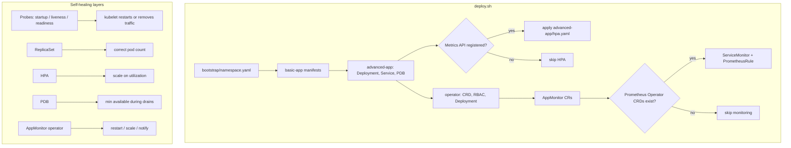

# Automated Kubernetes Self-Healing App

Author: sssrikar16-lgtm

Demo repo for **self-healing patterns** in Kubernetes: health probes, ReplicaSets, HPA, PDB, and a small **AppMonitor** operator (`healing.example.com`) that can restart, scale, or notify on repeated health check failures. All workloads target namespace **`self-healing`**.

## Contents

- [How it fits together](#how-it-fits-together)
- [Repository layout](#repository-layout)
- [Requirements](#requirements)
- [Quick start](#quick-start)
- [What `deploy.sh` does](#what-deploysh-does)
- [Manual apply](#manual-apply)
- [Custom image (optional)](#custom-image-optional)
- [Testing](#testing)
- [Monitoring](#monitoring)
- [Cleanup](#cleanup)
- [Troubleshooting](#troubleshooting)
- [Further reading](#further-reading)

## How it fits together



**Notes**

- **`advanced-app`** defaults to image `hashicorp/http-echo:0.2.3` listening on **8080**; all three probes use **`GET /`** on that port (not the Flask paths under `sample-app/` unless you switch the image).
- **`deploy.sh`** applies **HPA** only if the metrics API is registered; it applies **monitoring/** only if the Prometheus Operator CRDs exist.
- **`sample-app/`** is an optional **Flask + Gunicorn** app you can build as `your-registry/aksh-app` and wire into `advanced-app/deployment-with-probes.yaml` if you want richer `/health`, `/ready`, etc.

## Repository layout

```
Automated-Kubernetes-Self-healing-App/
├── deploy.sh, test-scenarios.sh, cleanup.sh
├── bootstrap/namespace.yaml
├── basic-app/               # nginx demo, no probes
├── advanced-app/          # http-echo + probes + service + pdb + hpa
├── operator/              # CRD, RBAC, in-cluster operator (Python), example AppMonitors
├── monitoring/            # ServiceMonitor + PrometheusRule (optional)
├── sample-app/            # Dockerfile + Flask app (optional custom image)
└── examples/all-in-one.yaml   # separate multi-doc reference (different ns in file)
```

## Requirements

| Required | Optional |
|----------|----------|
| Kubernetes **1.24+**, **kubectl**, **Bash** | **Docker** (build `sample-app` image) |
| | **Metrics Server** (HPA; install if `deploy.sh` skips HPA) |
| | **Prometheus Operator** (ServiceMonitor / PrometheusRule) |
| | **jq** (used in `test-scenarios.sh` for JSON) |

Install Metrics Server when you need HPA:

```bash
kubectl apply -f https://github.com/kubernetes-sigs/metrics-server/releases/latest/download/components.yaml
```

On Windows, run the scripts from **Git Bash**, **WSL**, or another environment that provides Bash and `kubectl`.

## Quick start

```bash
cd Automated-Kubernetes-Self-healing-App
chmod +x deploy.sh test-scenarios.sh cleanup.sh
./deploy.sh
kubectl get pods,svc,hpa,pdb -n self-healing
./test-scenarios.sh    # optional; destructive to a pod / process — use a lab cluster
./cleanup.sh          # when finished
```

## What `deploy.sh` does

1. `kubectl apply -f bootstrap/namespace.yaml`
2. Applies `basic-app/` (ConfigMap, Deployment, Service)
3. Applies `advanced-app/deployment-with-probes.yaml`, `service.yaml`, `pdb.yaml`
4. If metrics API exists → `advanced-app/hpa.yaml`
5. Applies `operator/crd.yaml`, `operator/rbac.yaml`, `operator/operator-deployment.yaml`, then `operator/custom-resource-example.yaml`
6. If ServiceMonitor CRD exists → `monitoring/servicemonitor.yaml` and `monitoring/alerts.yaml`
7. Waits for Deployments `basic-app`, `advanced-app`, `appmonitor-operator`

## Manual apply

Equivalent to the script (adjust if you skipped optional pieces):

```bash
kubectl apply -f bootstrap/namespace.yaml
kubectl apply -f basic-app/configmap.yaml -f basic-app/deployment.yaml -f basic-app/service.yaml
kubectl apply -f advanced-app/deployment-with-probes.yaml -f advanced-app/service.yaml -f advanced-app/pdb.yaml
kubectl apply -f advanced-app/hpa.yaml   # only after metrics-server
kubectl apply -f operator/crd.yaml
kubectl apply -f operator/rbac.yaml
kubectl apply -f operator/operator-deployment.yaml
kubectl apply -f operator/custom-resource-example.yaml
kubectl apply -f monitoring/servicemonitor.yaml -f monitoring/alerts.yaml   # only with Prometheus Operator
```

## Custom image (optional)

Image name **`aksh-app`** is shorthand for this project’s sample app.

```bash
cd sample-app
docker build -t your-registry/aksh-app:v1.0 .
docker push your-registry/aksh-app:v1.0
```

Set `spec.template.spec.containers[0].image` in `advanced-app/deployment-with-probes.yaml` to `your-registry/aksh-app:v1.0` and align probe `httpGet.path` / `port` with whatever your container exposes.

## Testing

- **`./test-scenarios.sh`** — walks liveness, readiness, pod delete, resource JSON, AppMonitors, HPA/PDB hints, events, operator logs. Requires `jq` where used.
- **Manual spot-checks** (namespace `self-healing`):

```bash
kubectl port-forward -n self-healing svc/advanced-app-service 8080:80
curl -s http://localhost:8080/ | head
kubectl logs -n self-healing -l app=appmonitor-operator --tail=50
kubectl get appmonitors -n self-healing -o wide
```

## Monitoring

If Prometheus Operator is installed and `deploy.sh` applied monitoring manifests:

```bash
kubectl get servicemonitor,prometheusrule -n self-healing
```

PrometheusRule object name in repo: **`aksh-alerts`** (group `aksh-apps`). PromQL still filters on `namespace="self-healing"`.

## Cleanup

```bash
./cleanup.sh
```

This deletes namespace **`self-healing`**, CRD **`appmonitors.healing.example.com`**, and cluster RBAC **`appmonitor-operator`**. To wipe manually, mirror those three steps.

## Troubleshooting

| Symptom | What to check |
|---------|----------------|
| HPA never created | `kubectl get apiservice v1beta1.metrics.k8s.io` — install metrics-server, re-run deploy or `kubectl apply -f advanced-app/hpa.yaml` |
| Monitoring skipped | `kubectl get crd servicemonitors.monitoring.coreos.com` — install Prometheus Operator stack first |
| Operator CrashLoop | `kubectl logs -n self-healing -l app=appmonitor-operator`; CRD `kubectl get crd appmonitors.healing.example.com` |
| Pods restarting | `kubectl describe pod -n self-healing <name>` — probe failures, image pull, limits |
| `test-scenarios.sh` errors | Install **`jq`**; ensure deploy succeeded and `advanced-app` pods exist |

## Further reading

- [Probes](https://kubernetes.io/docs/tasks/configure-pod-container/configure-liveness-readiness-startup-probes/)
- [HPA](https://kubernetes.io/docs/tasks/run-application/horizontal-pod-autoscale/)
- [PDB](https://kubernetes.io/docs/concepts/workloads/pods/disruptions/)
- [Custom resources](https://kubernetes.io/docs/concepts/extend-kubernetes/api-extension/custom-resources/)
- Annotated multi-doc example: [examples/all-in-one.yaml](examples/all-in-one.yaml)
